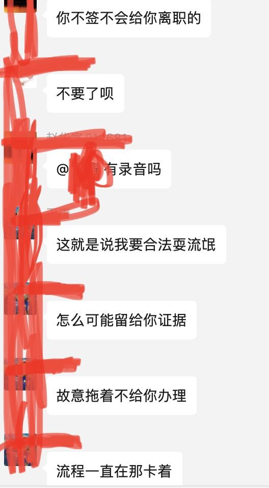
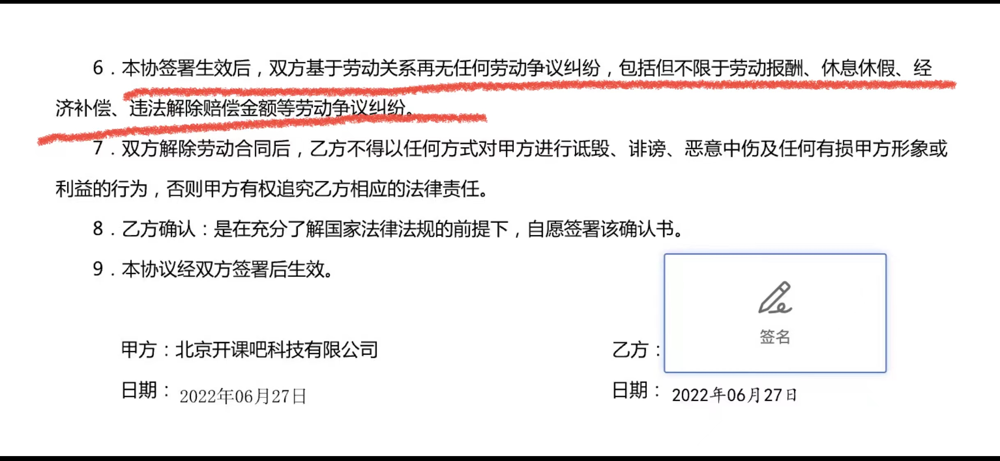
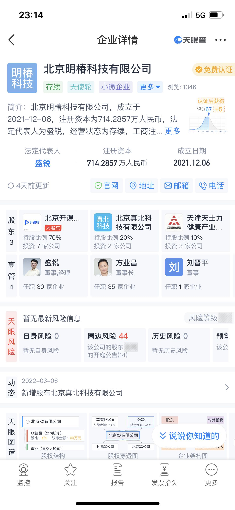
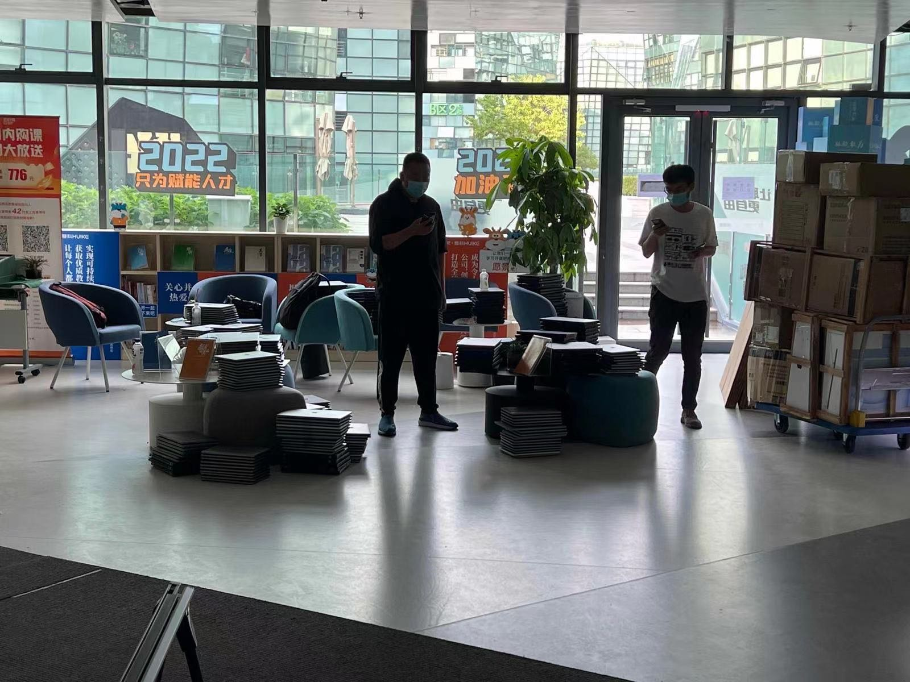
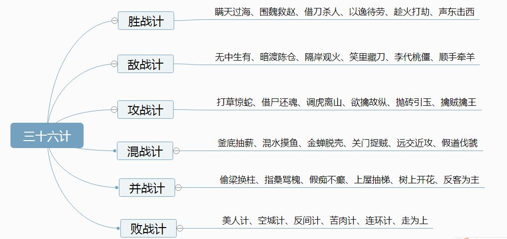

# 2022开课吧上演三十六计，各位IT同仁，教育圈的，开眼吧您！

### 1.”偷梁换柱+苦肉计“ ------CEO借给公司10个亿？员工三个月不发工资，社保断缴，不退学员学费，他成了受害者？

### 2.”笑里藏刀“ ---------想离职？“大郎先把这碗药喝了吧”

### 3. ”远交近攻“ ------离职的给点钱先稳住，在职的有班上要啥钱😂。社保断缴，临截止日期前30分钟打电话通知不想断的自己缴纳（23：30），然后。。。就减员了，对你没听错，在职减员。

### 4.”明修栈道暗度陈仓“ ------ 保安保洁当法人，把值钱的业务分拆出去继续骗钱。

### 5. ”借刀杀人+空城计“------谎报疫情让大家居家办公，居家结束后，继续居家，他们好搬东西。

**参考资料：**

**issues**中跟帖讨论, 希望大家踊跃**commit**和**star**。
 
电报群：https://t.me/kkbtaoxin 欢迎回家🌺🌺
访问方式：
1. https://666yun.men/ 花9块钱买个机场。
2. 免费参考：https://github.com/freefq/free
